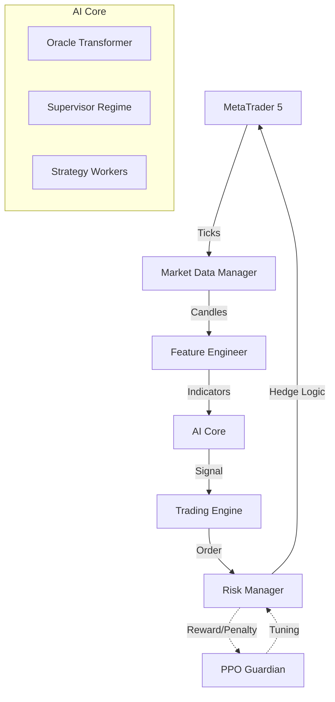

# AETHER Trading System - The Complete Technical Manual

**Version:** 5.5.8 (VELOCITY VETO)  
**Architecture:** Hybrid AI (Transformer + PPO + Heuristic)  
**Market:** XAUUSD (Gold) / Forex  
**Platform:** MetaTrader 5 (Windows)

---

## Table of Contents

1.  [Introduction](#1-introduction)
2.  [System Architecture](#2-system-architecture)
3.  [Installation & Setup (A-Z)](#3-installation--setup-a-z)
4.  [Configuration Guide](#4-configuration-guide)
5.  [Core Logic & Data Flow](#5-core-logic--data-flow)
    *   [5.1 The Tick Loop](#51-the-tick-loop)
    *   [5.2 AI Decision Making](#52-ai-decision-making)
    *   [5.3 Risk Management (Zone Recovery)](#53-risk-management-zone-recovery)
6.  [AI Models Explained](#6-ai-models-explained)
7.  [Project Structure (Micro-Details)](#7-project-structure-micro-details)
8.  [Troubleshooting](#8-troubleshooting)

---

## 1. Introduction

**AETHER** is an institutional-grade algorithmic trading system designed to solve the "Scalper's Dilemma": how to capture small profits frequently without being wiped out by sudden market reversals.

It achieves this by combining three distinct layers of intelligence:
1.  **The Oracle (Predictive):** A Transformer Neural Network that predicts future price candles.
2.  **The Supervisor (Strategic):** A heuristic engine that detects market regimes (Range vs. Trend).
3.  **The Guardian (Defensive):** A PPO (Proximal Policy Optimization) Reinforcement Learning agent that manages risk and hedging parameters in real-time.

Unlike simple "if-this-then-that" bots, AETHER builds a probabilistic model of the market every few milliseconds.

---

## 2. System Architecture

The system follows a **Micro-Component Architecture** where data flows linearly through specialized processing units.



---

## 3. Installation & Setup (A-Z)

Follow these steps exactly to set up the bot from scratch on a fresh Windows machine.

### Step A: Prerequisites
1.  **Install Python 3.10 or 3.11:** [Download Here](https://www.python.org/downloads/). *Ensure you check "Add Python to PATH" during installation.*
2.  **Install MetaTrader 5:** Download from your broker (e.g., Pepperstone, IC Markets, FTMO).
3.  **Install VS Code:** For editing and running the code.

### Step B: MT5 Configuration
1.  Open MetaTrader 5.
2.  Go to **Tools -> Options -> Expert Advisors**.
3.  Check **"Allow algorithmic trading"**.
4.  Check **"Allow DLL imports"**.
5.  Uncheck "Confirm" boxes to avoid popups blocking the bot.

### Step C: Project Setup
1.  Open the project folder in VS Code.
2.  Open a terminal (`Ctrl + ~`).
3.  Create a virtual environment:
    ```powershell
    python -m venv .venv
    ```
4.  Activate the environment:
    ```powershell
    .venv\Scripts\activate
    ```
5.  Install dependencies:
    ```powershell
    pip install -r requirements.txt
    ```
    *(Note: If you have a GPU, install PyTorch with CUDA support separately for faster AI processing).*

### Step D: Configuration
1.  Navigate to `config/`.
2.  Rename `secrets.example.env` to `secrets.env` (if not already done).
3.  Edit `secrets.env`:
    ```env
    MT5_LOGIN=12345678
    MT5_PASSWORD=your_password
    MT5_SERVER=Broker-Server-Name
    ```
4.  Edit `settings.yaml` to choose your symbol (e.g., `XAUUSD`) and lot size.

### Step E: Launch
1.  Run the bot:
    ```powershell
    python run_bot.py
    ```
2.  You should see `>>> [SYSTEM] Bot is Running` in the console.

---

## 4. Configuration Guide

### `config/settings.yaml` - The Control Panel

| Parameter | Description | Recommended |
| :--- | :--- | :--- |
| **`trading.symbol`** | The asset to trade. | `XAUUSD` (Gold) |
| **`trading.timeframe`** | Candle size for analysis. | `M1` (1 Minute) |
| **`risk.initial_lot`** | Starting trade size. | `0.01` per $1000 |
| **`risk.zone_recovery.zone_pips`** | Distance to hedge. | `25` (250 points) |
| **`risk.zone_recovery.tp_pips`** | Profit target. | `25` (250 points) |
| **`ai_parameters.nexus_confidence_threshold`** | Min AI confidence to trade. | `0.30` (30%) |

### `config/secrets.env` - Security
Stores sensitive data. **NEVER** share this file. It contains your broker login and database passwords.

---

## 5. Core Logic & Data Flow

### 5.1 The Tick Loop
Located in `src/main_bot.py`, this is the heartbeat of the system.
1.  **Wait for Tick:** The bot sleeps until MT5 reports a price change.
2.  **Update Data:** `MarketDataManager` adds the new price to the current candle.
3.  **Check Triggers:**
    *   Is the candle closed? -> Run full analysis.
    *   Is it just a tick? -> Check for Take Profit / Stop Loss logic.

### 5.2 AI Decision Making
Located in `src/trading_engine.py`.
1.  **Feature Extraction:** Calculates RSI, ATR, Bollinger Bands, and Z-Score.
2.  **Regime Detection (`Supervisor`):**
    *   *Logic:* `Volatility Ratio = Current ATR / Avg ATR`.
    *   If `Ratio > 2.5`, Regime = **CHAOS** (Do not trade).
    *   If `ADX > 25`, Regime = **TREND**.
    *   Else, Regime = **RANGE**.
3.  **Signal Generation:**
    *   **Range Worker:** Buys when RSI < 30, Sells when RSI > 70.
    *   **Trend Worker:** Buys when Price > EMA(50) and MACD is rising.
4.  **Oracle Validation:** The Transformer model predicts the next candle's close. If the Worker says BUY but Oracle predicts DOWN, the trade is vetoed.

### 5.3 Risk Management (Zone Recovery)
Located in `src/risk_manager.py`. This is the "Unbeatable" logic.

**The Algorithm:**
1.  **Entry:** BUY 0.01 @ 2000.00. Target: 2002.50.
2.  **Adverse Move:** Price drops to 1997.50 (Zone Boundary).
3.  **Hedge 1:** SELL 0.02 @ 1997.50.
    *   *New State:* Net -0.01 lots (Short bias).
    *   *New Target:* Price drops to 1995.00.
4.  **Reversal:** Price goes back up to 2000.00.
5.  **Hedge 2:** BUY 0.03 @ 2000.00.
    *   *New State:* Net +0.02 lots (Long bias).
    *   *New Target:* Price rises to 2003.00.
6.  **Conclusion:** The cycle continues until price breaks out of the "Zone" (1997.50 - 2000.00) far enough to close all trades for a net profit.

---

## 6. AI Models Explained

### The Oracle (`src/ai_core/oracle.py`)
*   **Type:** Time-Series Transformer (Encoder-only).
*   **Input:** Sequence of last 60 candles (Open, High, Low, Close, Volume).
*   **Output:** Predicted % change for the next candle.
*   **Training:** Pre-trained on 5 years of M1 Gold data.

### The Guardian (`src/ai_core/ppo_guardian.py`)
*   **Type:** Proximal Policy Optimization (PPO).
*   **Observation Space:** [Current Drawdown, Volatility, Trend Strength, Oracle Prediction].
*   **Action Space:** [Hedge Multiplier (1.0-1.5), Zone Width Modifier (0.5-2.0)].
*   **Goal:** Maximize Profit / Drawdown ratio. It learns to widen the zone during chaos and tighten it during calm.

---

## 7. Project Structure (Micro-Details)

*   **`src/bridge/mt5_adapter.py`**: The low-level driver. It wraps the `MetaTrader5` Python library. It handles connection retries, order sending, and error code parsing (e.g., "Market Closed", "Not Enough Money").
*   **`src/features/market_features.py`**: The math library. Contains optimized functions for `spread_atr`, `zscore`, `linear_regression_slope`, etc.
*   **`src/utils/news_filter.py`**: Connects to an external API (or local JSON) to block trading 30 minutes before High Impact news (NFP, FOMC).
*   **`data/position_state.json`**: A crash-recovery file. Every time a trade is opened, it's written here. If the PC crashes, the bot reads this file on restart to "remember" its open hedges.

---

## 8. Troubleshooting

| Error | Cause | Fix |
| :--- | :--- | :--- |
| `IPC timeout` | MT5 is closed or blocked. | Open MT5, close dialogs, enable Algo Trading. |
| `Trade Disabled` | Broker or Account issue. | Check if you are using a read-only password or if market is closed. |
| `Retcode 10004` | Requote. | Increase `max_slippage` in `settings.yaml`. |
| `ImportError: torch` | PyTorch not installed. | Run `pip install torch`. |

---

**Disclaimer:** Trading Forex and Commodities involves high risk. This software is for educational purposes. Use at your own risk.
